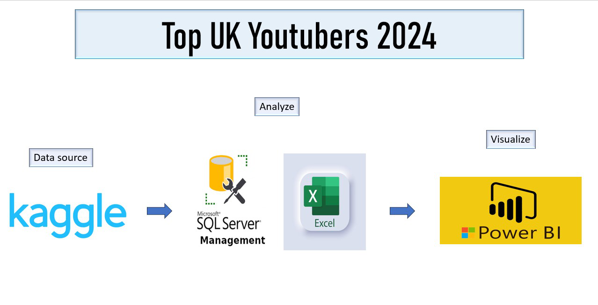
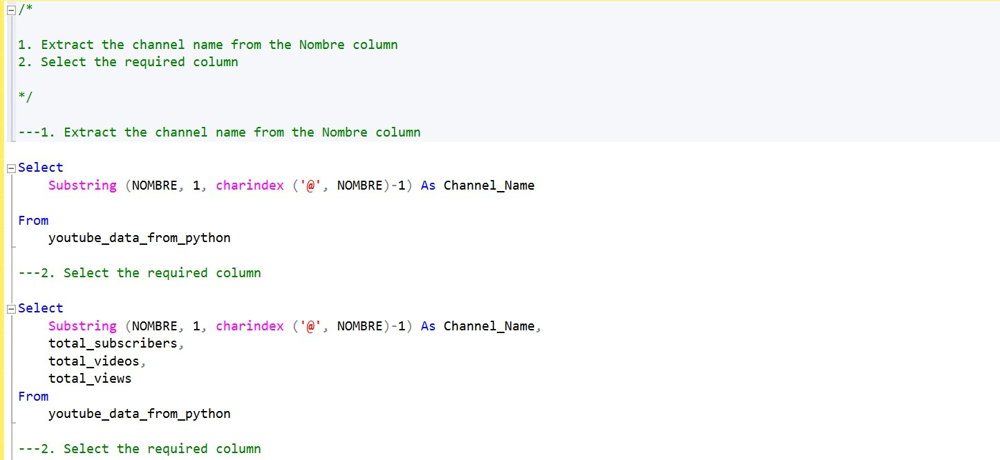
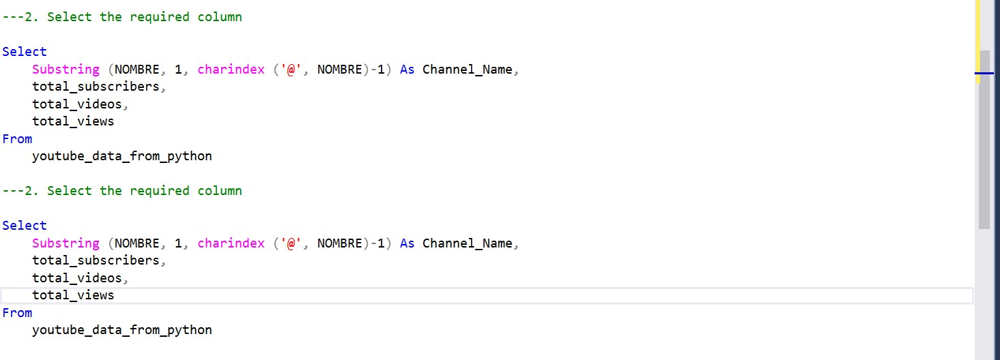

# Data portfolio project: Top UK YouTuber's, 2024



# Table of Content

- [Objective](#objective)
  - [Questions to answer](#questions-to-answer)
  - [User demand](#user-demand)
- [Project Approach](#project-approach)
- [Preparation](#preparation)
  - [Tools](#tools)
  - [Data source](#Data-source)
  - [Preparation of dashboard requirements](#preparation-of-dashboard-requirements)
- [Processing](#processing)


# Objectives
The main objective of this project is to find out the top Youtubers in the Uk in order to determine which is best to run marketing campaigns with in 2024.

## Questions to answer

- Who are the top 3 Youtubers in the UK based on subscriber count
- Who are the top 3 youtubers in the UK based on total videos uploaded
- Who are the top 3 Youtubers in the UK based on total Views
- What are the engagement metrics
- Based on the average views per video, who are the top 3 youtubers in the UK base on subscriber count, total videos uploaded and total views

## User demand

The marketing team needs a dashboard to be able to effectively decide who to run the marketing campaign with in order to optimize profit.
A dashboard was required by the marketing team and recommendations based on further analysis from the data analysis team.


# Project Approach
To ensure a proper execution of this project, the project was divided into six phases

- Determining the Objectives
- Preparation
- Processing
- Visualization development
- Analysis based on insights from visuals
- Recommendations and conclusion

The general approach in carrying out this project involves the following

1. Obtaining the data from Kaggle
2. Exploring the data in excel
3. Loading the data in SQL
4. Cleaning the data in SQL
5. Transforming the data in SQL
6. Developing visualizations in PowerBI
7. Analysing insights in Excel
8. Providing recommendations based on the insights
   

# Preparation
The first step in the preparation phase involves deciding which tools to use. The following tools were chosen;
## Tools 


| Tool | Purpose |
| --- | --- |
| Excel | Exploring the data |
| SQL Server | Cleaning, testing, and analyzing the data |
| Power BI | Visualizing the data via interactive dashboards |
| GitHub | Hosting the project documentation and version control |
| Mokkup AI | Designing the wireframe/mockup of the dashboard | 

## Data source

The preparation phase involved sourcing for the data for this project. The data should include colums like:
- channel names
- total subscribers
- total views
- total videos uploaded
  
The data was sourced from Kaggle (an Excel extract), [see here to find it.](https://www.kaggle.com/datasets/bhavyadhingra00020/top-100-social-media-influencers-2024-countrywise?resource=download)

## Preparation of Dashboard requirements
The dashboard should contain requirements that answers the questions stated earlier.

MockupAI was used to design a draft of what the dashboard shoukd like and it components. 

The dashboard will show the following:
A table showing the Channel names, subscriber count, total videos uploaded and total views
A Tree map showing the channels with the highest views
A Bar chart showing the Top youtubers by subscriber count
Three score cards showing engagement metrics such as the average views per video, subscriber engagement rate per video, Views per subscriber


# Processing
The processing of the data was done in four parts:
- Data Exploration
- Data cleaning
- Data transformation

## Data Exploration

Data exploration was done to check for the structure, inconsistencies, bugs, weird entreis. e.t.c in the dataset.
Initial observation includes the following;
- The Channel ID colums included the '@' of each youtuber. The channel names can thus be extracted from this column
- There where atleast 4 columns which indicated we had sufficient data
- Some columns included entries in other languages. The columns were observed to not be useful for the project so they were discarded.
- There's excessive data than needed so some columns need to be discarded

## Data Cleaning

Data cleaning was done on the dataset to prepare it for analysis. this was done using the sequel server management studion (SSMS).
Data cleaning steps involved the following:
1. Ensuring only relevant columns are retained
2. Ensuring all columns are in the appropriate data type
3. Ensuring no column contains null values which gives us complete data to work with.

It is expected that the datasets meet the following criteria in column count and row count:

| Property | Description |
| --- | --- |
| Number of Rows | 100 |
| Number of Columns | 4 |

It was also expected that the cleaned data should have the following data type:

| Column Name | Data Type | Nullable |
| --- | --- | --- |
| channel_name | VARCHAR | NO |
| total_subscribers | INTEGER | NO |
| total_views | INTEGER | NO |
| total_videos | INTEGER | NO |


In cleaning the data to the desired structure, the following was carried out

1. Remove unnecessary columns by only selecting the ones you need
2. Extract Youtube channel names from the first column
3. Rename columns using aliases

### Data cleaning and transformation in SQL

```sql
/*

1. Extract the channel name from the Nombre column
2. Select the required column

*/

---1. Extract the channel name from the Nombre column

Select
	Substring (NOMBRE, 1, charindex ('@', NOMBRE)-1) As Channel_Name 

From 
	youtube_data_from_python
 
 ---2. Select the required column

Select
	Substring (NOMBRE, 1, charindex ('@', NOMBRE)-1) As Channel_Name,
	total_subscribers,
    total_videos,
    total_views
From 
	youtube_data_from_python
```


