# Data portfolio project: Top UK YouTuber's, 2024


# Table of Content

- [Objective](#objective)
  - [Questions to answer](#questions-to-answer)
  - [User demand](#user-demand)
- [Project Approach](#project-approach)
- [Preparation](#preparation)
  - [Tools](#tools)
  - [Data source](#Data-source)
  - [Preparation of dashboard requirements](#preparation-of-dashboard-requirements)
- [Processing](#processing)
  - [Data exploration](#data-exploration)
  - [Data cleaning](#data-cleaning)
     -[Data cleaning and transformation in SQL](#data-cleaning-and-transformation-in-sql)
  - [Testing the data](#testing-the-data)
- [Development of visuals](#development-of-visuals)
  - [Results](#results)
  - [DAX Measures](#dax-measures)
- [Analysis](#analysis)
   - [Validation](#validation)

# Objectives
The main objective of this project is to find out the top Youtubers in the Uk in order to determine which is best to run marketing campaigns with in 2024.

## Questions to answer

1. Who are the top 3 Youtubers in the UK based on subscriber count
2. Who are the top 3 youtubers in the UK based on total videos uploaded
3. Who are the top 3 Youtubers in the UK based on total Views
4. Which 3 channels have the highest average views per video?
5. Which 3 channels have the highest views per subscriber ratio?
6. Which 3 channels have the highest subscriber engagement rate per video uploaded?

## User demand

The marketing team needs a dashboard to be able to effectively decide who to run the marketing campaign with in order to optimize profit.
A dashboard was required by the marketing team and recommendations based on further analysis from the data analysis team.


# Project Approach
To ensure a proper execution of this project, the project was divided into six phases

- Determining the Objectives
- Preparation
- Processing
- Visualization development
- Analysis based on insights from visuals
- Recommendations and conclusion

The general approach in carrying out this project involves the following

1. Obtaining the data from Kaggle
2. Exploring the data in excel
3. Loading the data in SQL
4. Cleaning the data in SQL
5. Transforming the data in SQL
6. Developing visualizations in PowerBI
7. Analysing insights in Excel
8. Providing recommendations based on the insights
   

# Preparation
The first step in the preparation phase involves deciding which tools to use. The following tools were chosen;
## Tools 


| Tool | Purpose |
| --- | --- |
| Excel | Exploring the data |
| SQL Server | Cleaning, testing, and analyzing the data |
| Power BI | Visualizing the data via interactive dashboards |
| GitHub | Hosting the project documentation and version control |
| Mokkup AI | Designing the wireframe/mockup of the dashboard | 

## Data source

The preparation phase involved sourcing for the data for this project. The data should include colums like:
- channel names
- total subscribers
- total views
- total videos uploaded
  
The data was sourced from Kaggle (an Excel extract), [see here to find it.](https://www.kaggle.com/datasets/bhavyadhingra00020/top-100-social-media-influencers-2024-countrywise?resource=download)

## Preparation of Dashboard requirements
The dashboard should contain requirements that answers the questions stated earlier.

MockupAI was used to design a draft of what the dashboard shoukd like and it components. 

The dashboard will show the following:
A table showing the Channel names, subscriber count, total videos uploaded and total views
A Tree map showing the channels with the highest views
A Bar chart showing the Top youtubers by subscriber count
Three score cards showing engagement metrics such as the average views per video, subscriber engagement rate per video, Views per subscriber


# Processing
The processing of the data was done in four parts:
- Data Exploration
- Data cleaning
- Data transformation

## Data Exploration

Data exploration was done to check for the structure, inconsistencies, bugs, weird entreis. e.t.c in the dataset.
Initial observation includes the following;
- The Channel ID colums included the '@' of each youtuber. The channel names can thus be extracted from this column
- There where atleast 4 columns which indicated we had sufficient data
- Some columns included entries in other languages. The columns were observed to not be useful for the project so they were discarded.
- There's excessive data than needed so some columns need to be discarded

## Data Cleaning

Data cleaning was done on the dataset to prepare it for analysis. this was done using the sequel server management studion (SSMS).
Data cleaning steps involved the following:
1. Ensuring only relevant columns are retained
2. Ensuring all columns are in the appropriate data type
3. Ensuring no column contains null values which gives us complete data to work with.

It is expected that the datasets meet the following criteria in column count and row count:

| Property | Description |
| --- | --- |
| Number of Rows | 100 |
| Number of Columns | 4 |

It was also expected that the cleaned data should have the following data type:

| Column Name | Data Type | Nullable |
| --- | --- | --- |
| channel_name | VARCHAR | NO |
| total_subscribers | INTEGER | NO |
| total_views | INTEGER | NO |
| total_videos | INTEGER | NO |


In cleaning the data to the desired structure, the following was carried out

1. Remove unnecessary columns by only selecting the ones you need
2. Extract Youtube channel names from the first column
3. Rename columns using aliases

### Data cleaning and transformation in SQL

```sql
/*

1. Extract the channel name from the Nombre column
2. Select the required column

*/

---1. Extract the channel name from the Nombre column

Select
	Substring (NOMBRE, 1, charindex ('@', NOMBRE)-1) As Channel_Name 

From 
	youtube_data_from_python
 
 ---2. Select the required column

Select
	Substring (NOMBRE, 1, charindex ('@', NOMBRE)-1) As Channel_Name,
	total_subscribers,
    total_videos,
    total_views
From 
	youtube_data_from_python
```


```sql
/*
3. Create a view with the transformed data containing only the required columns and cast the channel name as Varchar

*/

---3.

Create View top_UK_Youtubers_2024 As

Select CAST(SUBSTRING (NOMBRE, 1, Charindex ('@', NOMBRE)-1)As varchar (100)) as channel_name,
   total_subscribers,
   total_videos,
   total_views
From youtube_data_from_python
```
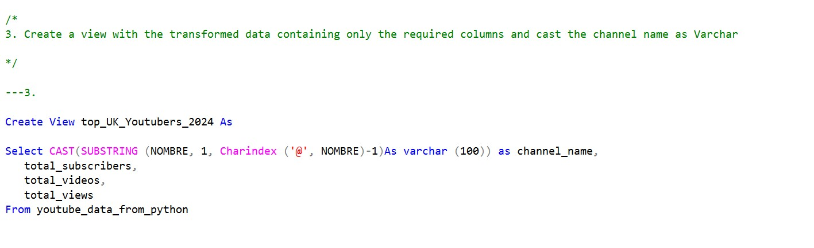

## Testing the data

When testing the data, several data quality and validation checks were conducted

```sql
/*

# DATA QUALITY CHECKS
1.The data needs to be 100 records of youtube channels (Row count test) (Passed!!!)
2. The data needs 4 fields (Column count test) (passed!!!)
3. The channel name must be string format and the other colums must be numerical data type (passed!!!)
4. Each record must be unique in the dataset (Duplicate count check) (passed!!!)

Row count = 100
Column count = 4

# Data types
Channel name = VARCHAR
total_subscribers = Integer
total_views = Integer
total_videos = Integer

# There must be zero duplicates
*/

---1. Row count check

select 
	COUNT (*) as no_of_rows 
from 
	top_UK_Youtubers_2024

---2. Column count check

Select 
	count (*) as column_count
from 
	INFORMATION_SCHEMA.COLUMNS 
where 
	Table_name = 'top_UK_Youtubers_2024'

---3. data type check 

Select 
	COLUMN_NAME, DATA_TYPE
from 
	INFORMATION_SCHEMA.COLUMNS 
where 
	Table_name = 'top_UK_Youtubers_2024'

---4. duplicate check

Select 
	Channel_name, Count (*) as duplicate_count
From 
	top_UK_Youtubers_2024
Group by
	Channel_name
Having Count (*) > 1
```
### Row count check

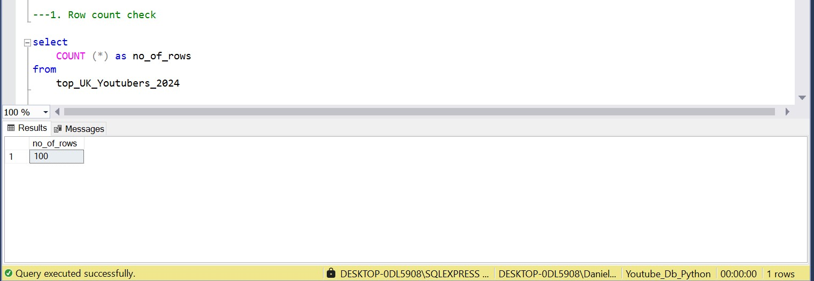

### Column count check

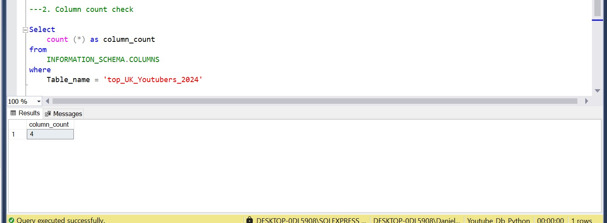

### Data type check

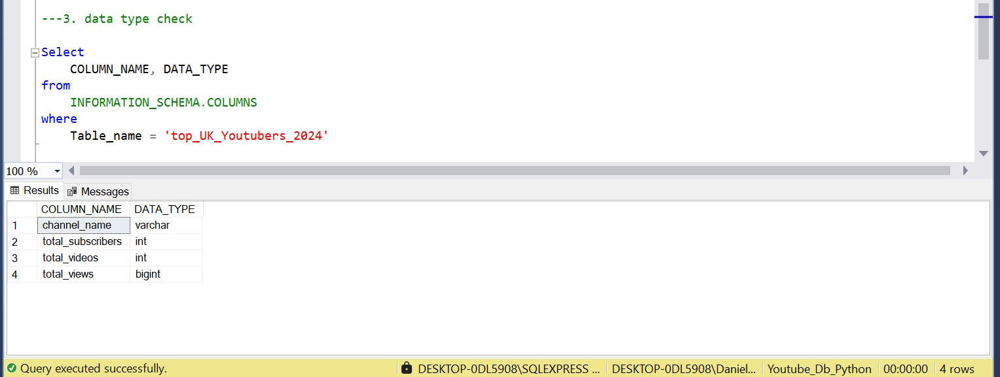

### Duplicate check


# Development of Visuals

## Results

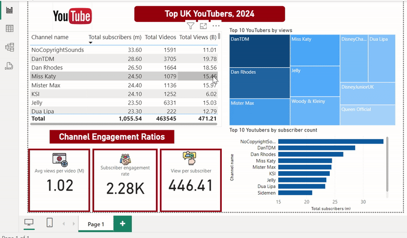

## DAX Measures

### 1. Total Subscribers (M)

```sql
Total Subscribers (M) = 
VAR million = 1000000
VAR sumOfSubscribers = SUM(view_uk_youtubers_2024[total_subscribers])
VAR totalSubscribers = DIVIDE(sumOfSubscribers,million)

RETURN totalSubscribers

```

### 2. Total Views (B)
```sql
Total Views (B) = 
VAR billion = 1000000000
VAR sumOfTotalViews = SUM(view_uk_youtubers_2024[total_views])
VAR totalViews = ROUND(sumOfTotalViews / billion, 2)

RETURN totalViews

```

### 3. Total Videos
```sql
Total Videos = 
VAR totalVideos = SUM(view_uk_youtubers_2024[total_videos])

RETURN totalVideos

```

### 4. Average Views Per Video (M)
```sql
Average Views per Video (M) = 
VAR sumOfTotalViews = SUM(view_uk_youtubers_2024[total_views])
VAR sumOfTotalVideos = SUM(view_uk_youtubers_2024[total_videos])
VAR  avgViewsPerVideo = DIVIDE(sumOfTotalViews,sumOfTotalVideos, BLANK())
VAR finalAvgViewsPerVideo = DIVIDE(avgViewsPerVideo, 1000000, BLANK())

RETURN finalAvgViewsPerVideo 

```


### 5. Subscriber Engagement Rate
```sql
Subscriber Engagement Rate = 
VAR sumOfTotalSubscribers = SUM(view_uk_youtubers_2024[total_subscribers])
VAR sumOfTotalVideos = SUM(view_uk_youtubers_2024[total_videos])
VAR subscriberEngRate = DIVIDE(sumOfTotalSubscribers, sumOfTotalVideos, BLANK())

RETURN subscriberEngRate 

```


### 6. Views per subscriber
```sql
Views Per Subscriber = 
VAR sumOfTotalViews = SUM(view_uk_youtubers_2024[total_views])
VAR sumOfTotalSubscribers = SUM(view_uk_youtubers_2024[total_subscribers])
VAR viewsPerSubscriber = DIVIDE(sumOfTotalViews, sumOfTotalSubscribers, BLANK())

RETURN viewsPerSubscriber 

```

# Analysis

The analysis for this project focused on the following questions:
1. Who are the top 3 Youtubers in the UK based on subscriber count
2. Who are the top 3 youtubers in the UK based on total videos uploaded
3. Who are the top 3 Youtubers in the UK based on total Views
4. Which 3 channels have the highest average views per video?
5. Which 3 channels have the highest views per subscriber ratio?
6. Which 3 channels have the highest subscriber engagement rate per video uploaded?


## 1. Who are the top 3 YouTubers with the most subscribers?

| Rank | Channel Name         | Subscribers (M) |
|------|----------------------|-----------------|
| 1    | NoCopyrightSounds    | 33.60           |
| 2    | DanTDM               | 28.60           |
| 3    | Dan Rhodes           | 26.50           |


## 2. Which 3 channels have uploaded the most videos?

| Rank | Channel Name    | Videos Uploaded |
|------|-----------------|-----------------|
| 1    | GRM Daily       | 14,696          |
| 2    | Manchester City | 8,248           |
| 3    | Yogscast        | 6,435           |


## 3. Which 3 channels have the most views?

| Rank | Channel Name | Total Views (B) |
|------|--------------|-----------------|
| 1    | DanTDM       | 19.78           |
| 2    | Dan Rhodes   | 18.56           |
| 3    | Mister Max   | 15.97           |


## 4. Which 3 channels have the highest average views per video?

| Channel Name | Averge Views per Video (M) |
|--------------|-----------------|
| Mark Ronson  | 32.27           |
| Jessie J     | 5.97            |
| Dua Lipa     | 5.76            |


## 5. Which 3 channels have the highest views per subscriber ratio?

| Rank | Channel Name       | Views per Subscriber        |
|------|-----------------   |---------------------------- |
| 1    | GRM Daily          | 1185.79                     |
| 2    | Nickelodeon        | 1061.04                     |
| 3    | Disney Junior UK   | 1031.97                     |


## 6. Which 3 channels have the highest subscriber engagement rate per video uploaded?

| Rank | Channel Name    | Subscriber Engagement Rate  |
|------|-----------------|---------------------------- |
| 1    | Mark Ronson     | 343,000                     |
| 2    | Jessie J        | 110,416.67                  |
| 3    | Dua Lipa        | 104,954.95                  |


### Notes

In order to generate better ROI for the marketing client, this study prioritized metrics associated with youtubers with the:
- Most Subscribers
- Most Videos
- Most Views
  
Insights on the average views per video of these category of youtubers will inform the marketing team which is best to collaborate with.

## Validation 

### 1. Youtubers with the most subscribers 

The Campaign idea if the youtubers with the most subscribers should be proritized will involve product placement.
A conversion rate of 2% was assumed by the data analytics team. Each product to be advertised cost 5$ and the cost of running the campaign was 50,000$

#### Calculation breakdown
A. NoCopyrightSounds 
- Average views per video = 6.92 million
- Conversion rate = 2% = 0.02
- Product cost = $5
- Campaign cost (one-time fee) = $50,000
- Potential units sold per video = 6.92 million x 2% conversion rate = 138,400 units sold
- Potential revenue per video = 138,400 x $5 = $692,000
- Net profit = Potential revenue per video - campaign cost
  
- **Net profit = $692,000 - $50,000 = $642,000**

b. DanTDM

- Average views per video = 5.34 million
- Conversion rate = 2% = 0.02
- Product cost = $5
- Campaign cost (one-time fee) = $50,000
- Potential units sold per video = 5.34 million x 2% conversion rate = 106,800 units sold
- Potential revenue per video = 106,800 x $5 = $534,000
- Net profit = Potential revenue per video - campaign cost
  
- **Net profit = $534,000 - $50,000 = $484,000**

c. Dan Rhodes

- Average views per video = 11.15 million
- Conversion rate = 2% = 0.02
- Product cost = $5
- Campaign cost (one-time fee) = $50,000
- Potential units sold per video = 11.15 million x 2% conversion rate = 223,000 units sold
- Potential revenue per video = 223,000 x $5 = $1,115,000
- Net profit = Potential revenue per video - campaign cost

- **Net profit = $1,115,000 - $50,000 = $1,065,000**


Best option from category: Dan Rhodes

```Sql
/*

1. Define the variables
2. Create a CTE that rounds the average views per video
3. Select the columns that are required for the analysis
4. Order by net_profit (from highest to lowest)

*/

---1. Define the variables
Declare @ConversionRate Float = 0.02; ---The conversion rate @2%
Declare @ProductCost Float = 5.0; --- The product cost @ 5.0 USD
Declare @CampaignCost Float = 50000.0; --- The campaign cost @ 50000 USD


---2 Create a CTE that rounds the average views per video

With ChannelData As (
	Select
		channel_name,
		total_views,
		total_videos,
		Round ((Cast (total_views as Float) /total_videos), -4) As rounded_avg_views_per_video
From 
	Youtube_Db_Python.dbo.top_UK_Youtubers_2024

	)

---3. Select the columns that are required for the analysis

	Select 
	 channel_name,
    rounded_avg_views_per_video,
    (rounded_avg_views_per_video * @conversionRate) AS potential_units_sold_per_video,
    (rounded_avg_views_per_video * @conversionRate * @productCost) AS potential_revenue_per_video,
    ((rounded_avg_views_per_video * @conversionRate * @productCost) - @campaignCost) AS net_profit
	from ChannelData

---4.
Where channel_name IN ('NoCopyrightSounds', 'DanTDM', 'Dan Rhodes')

---5.

Order by Net_profit DESC

```
#### Output
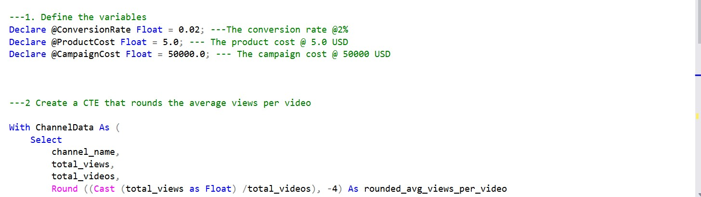
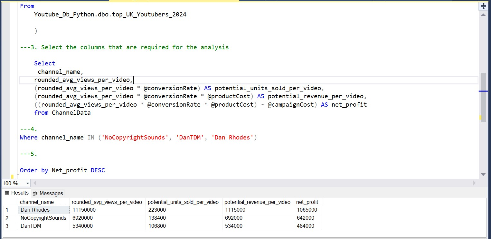

### 2. Youtubers with the most videos uploaded

### Calculation breakdown 

The campaign idea if youtubers with the most videos uploaded is prioritized will be to sponsor video series.
A conversion rate of 2% was assumed by the data analytics team. Each product to be advertised cost 5$ and the cost of running the campaign was 55,000$ for 11 videos as a budget of 5,000$ was to be spent on one video.

A. **GRM Daily**
- Average views per video = 510,000
- Conversion rate = 2% = 0.02
- Product cost = $5
- Campaign cost (11-videos @ $5,000 each) = $55,000
- Potential units sold per video = 510,000 x 2% conversion rate = 10,200 units sold
- Potential revenue per video = 10,200 x $5= $51,000
- Net profit = Potential revenue per video - campaign cost

- **Net profit = $51,000 - $55,000 = -$4,000 (potential loss)**

b. **Manchester City**

- Average views per video = 240,000
- Conversion rate = 2% = 0.02
- Product cost = $5
- Campaign cost (11-videos @ $5,000 each) = $55,000
- Potential units sold per video = 240,000 x 2% conversion rate = 4,800 units sold
- Potential revenue per video = 4,800 x $5= $24,000
- Net profit = Potential revenue per video - campaign cost

- **Net profit = $24,000 - $55,000 = -$31,000 (potential loss)**

C. **Yogscast**

- Average views per video = 710,000
- Conversion rate = 2% = 0.02
- Product cost = $5
- Campaign cost (11-videos @ $5,000 each) = $55,000
- Potential units sold per video = 710,000 x 2% conversion rate = 14,200 units sold
- Potential revenue per video = 14,200 x $5= $71,000
- Net profit = Potential revenue per video - campaign cost

- **Net profit = $71,000 - $55,000 = $16,000 (profit)**


Best option from category: Yogscast

```Sql
/* 
# 1. Define variables
# 2. Create a CTE that rounds the average views per video
# 3. Select the columns you need and create calculated columns from existing ones
# 4. Filter results by YouTube channels
# 5. Sort results by net profits (from highest to lowest)
*/


-- 1.
DECLARE @conversionRate FLOAT = 0.02;           -- The conversion rate @ 2%
DECLARE @productCost FLOAT = 5.0;               -- The product cost @ $5
DECLARE @campaignCostPerVideo FLOAT = 5000.0;   -- The campaign cost per video @ $5,000
DECLARE @numberOfVideos INT = 11;               -- The number of videos (11)


-- 2.
WITH ChannelData AS (
    SELECT
        channel_name,
        total_views,
        total_videos,
        ROUND((CAST(total_views AS FLOAT) / total_videos), -4) AS rounded_avg_views_per_video
    FROM
    Youtube_Db_Python.dbo.top_UK_Youtubers_2024

	)
-- 3.
SELECT
    channel_name,
    rounded_avg_views_per_video,
    (rounded_avg_views_per_video * @conversionRate) AS potential_units_sold_per_video,
    (rounded_avg_views_per_video * @conversionRate * @productCost) AS potential_revenue_per_video,
    ((rounded_avg_views_per_video * @conversionRate * @productCost) - (@campaignCostPerVideo * @numberOfVideos)) AS net_profit
FROM
    ChannelData


-- 4.
WHERE
    channel_name IN ('GRM Daily', 'Man City', 'YOGSCAST Lewis & Simon ')


-- 5.
ORDER BY
    net_profit DESC;
```
#### Output
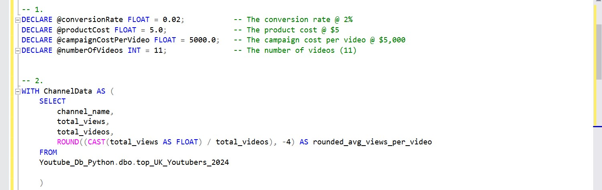
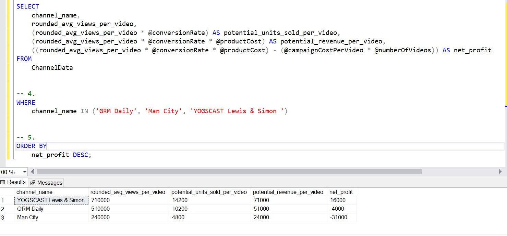

### 3.  Youtubers with the most views 

#### Calculation breakdown

The campaign idea if youtubers with the most views is prioritized will be influencer marketing. 
A conversion rate of 2% was assumed by the data analytics team. Each product to be advertised cost 5$ and the cost of running the campaign was 130,000$ for a period of 3 months

a. DanTDM

- Average views per video = 5.34 million
- Conversion rate = 2% = 0.02
- Product cost = $5
- Campaign cost (3-month contract) = $130,000
- Potential units sold per video = 5.34 million x 2% conversion rate = 106,800 units sold
- Potential revenue per video = 106,800 x $5 = $534,000
- Net profit = Potential revenue per video - campaign cost

- **Net profit = $534,000 - $130,000 = $404,000**

b. **Dan Rhodes**

- Average views per video = 11.15 million
- Conversion rate = 2% = 0.02
- Product cost = $5
- Campaign cost (3-month contract) = $130,000
- Potential units sold per video = 11.15 million x 2% conversion rate = 223,000 units sold
- Potential revenue per video = 223,000 x $5 = $1,115,000
- Net profit = Potential revenue per video - campaign cost
  
- **Net profit = $1,115,000 - $130,000 = $985,000**

c. **Mister Max**

- Average views per video = 14.06 million
- Conversion rate = 2% = 0.02
- Product cost = $5
- Campaign cost (3-month contract) = $130,000
- Potential units sold per video = 14.06 million x 2% conversion rate = 281,200 units sold
- Potential revenue per video = 281,200 x $5 = $1,406,000
- Net profit = Potential revenue per video - campaign cost

- **Net profit = $1,406,000 - $130,000 = $1,276,000**

Best option from category: Mister Max

#### Output
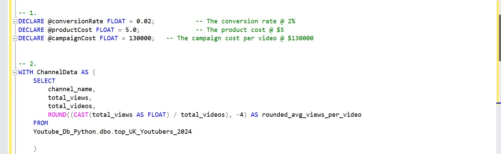
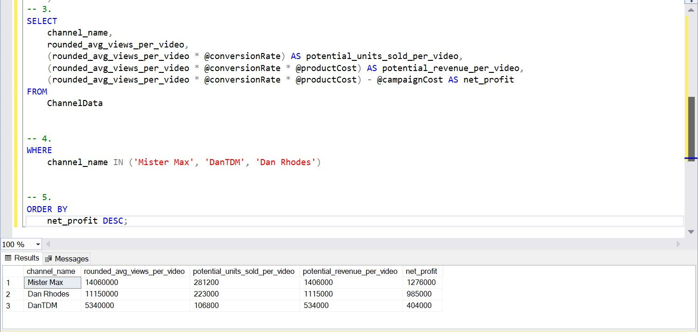
